# Game Story AI 🎮✨

<div align="center">

[🇷🇺 Русский](README.md) | [🇬🇧 English](README-EN.md)

AI-powered game story generator that transforms text descriptions into interactive quests and storylines.


</div>

<div align="center">
  <h2>🎬 Demo</h2>
  
  <table>
    <tr>
      <td width="50%" align="center">
        <b>🏠 Main Menu</b><br>
        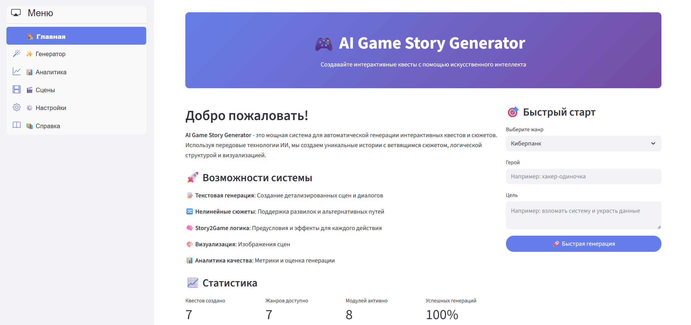
        <i>Intuitive interface for quick start</i>
      </td>
      <td width="50%" align="center">
        <b>⚙️ Quest Generator</b><br>
        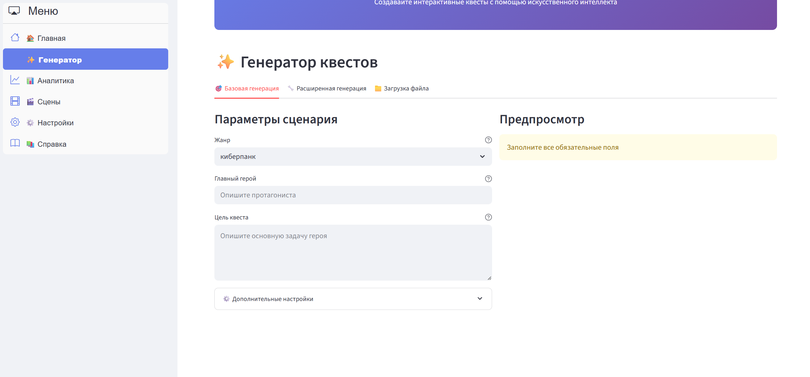
        <i>Flexible generation settings</i>
      </td>
    </tr>
    <tr>
      <td width="50%" align="center">
        <b>🔄 Generation Process</b><br>
        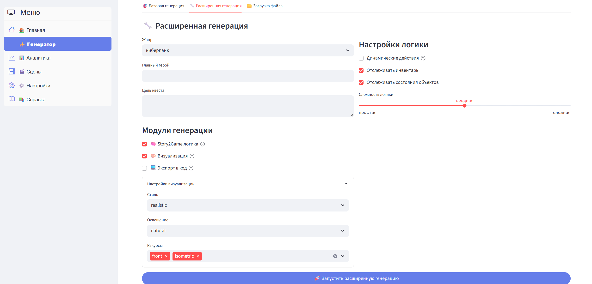
        <i>Real-time progress tracking</i>
      </td>
      <td width="50%" align="center">
        <b>📊 Analytics & Statistics</b><br>
        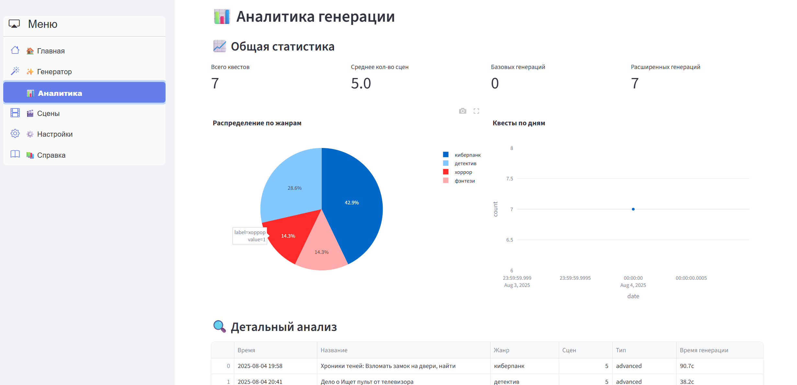
        <i>Detailed generation metrics</i>
      </td>
    </tr>
  </table>
  
  <details open>
  <summary><b>🎭 Generated Scenes Gallery</b></summary>
  
  <br>
  
  <table>
    <tr>
      <td width="33%" align="center">
        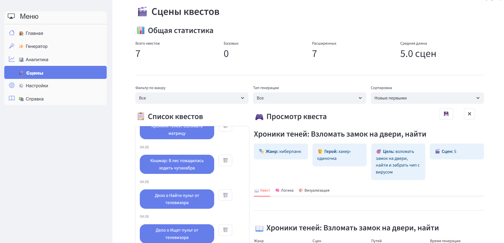
        <i>Starting location</i>
      </td>
      <td width="33%" align="center">
        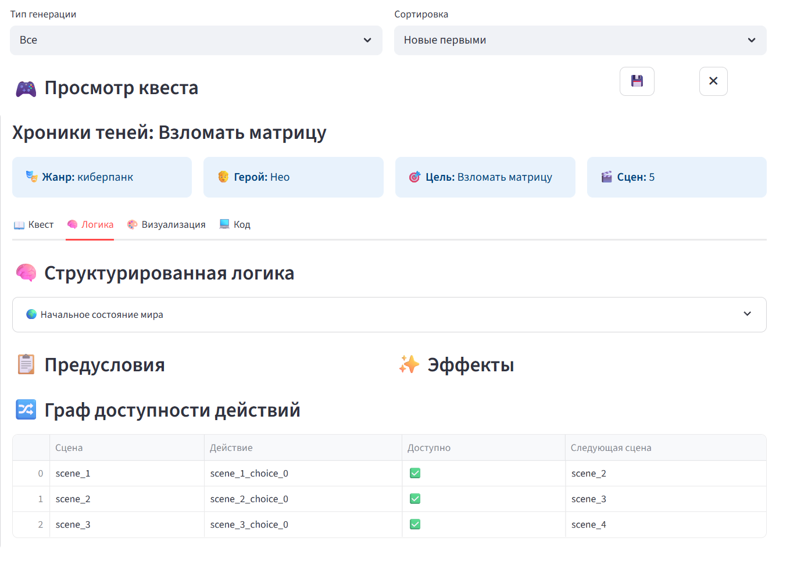
        <i>Story development</i>
      </td>
      <td width="33%" align="center">
        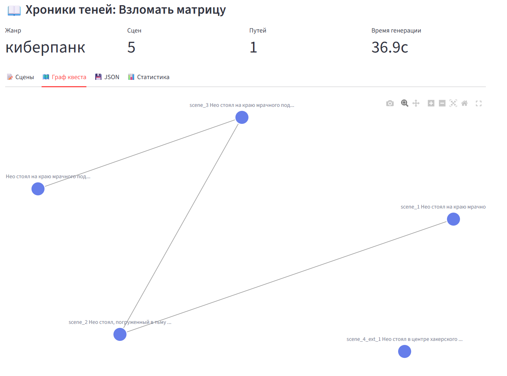
        <i>Key choice point</i>
      </td>
    </tr>
    <tr>
      <td width="33%" align="center">
        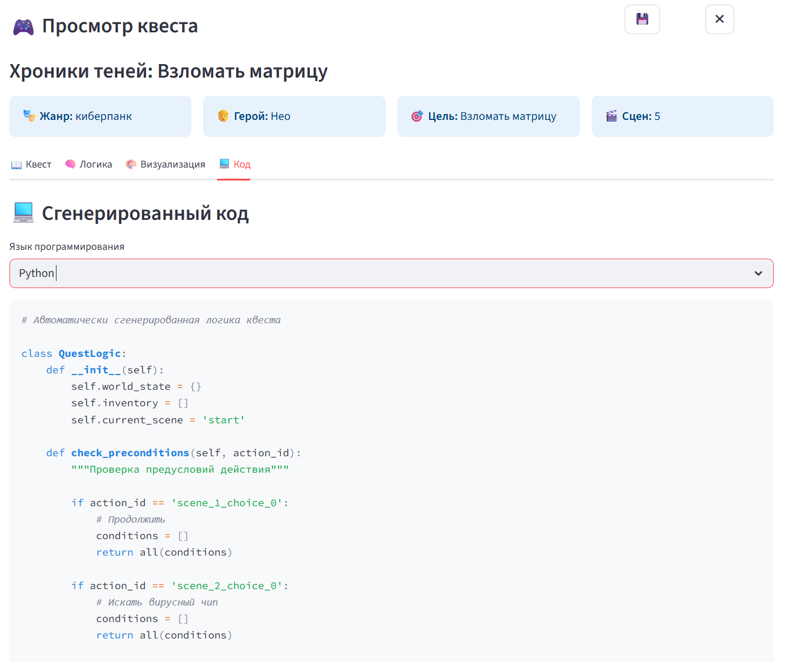
        <i>Alternative path</i>
      </td>
      <td width="33%" align="center">
        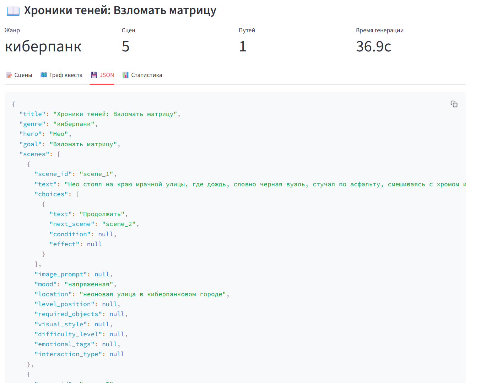
        <i>Climax scene</i>
      </td>
      <td width="33%" align="center">
        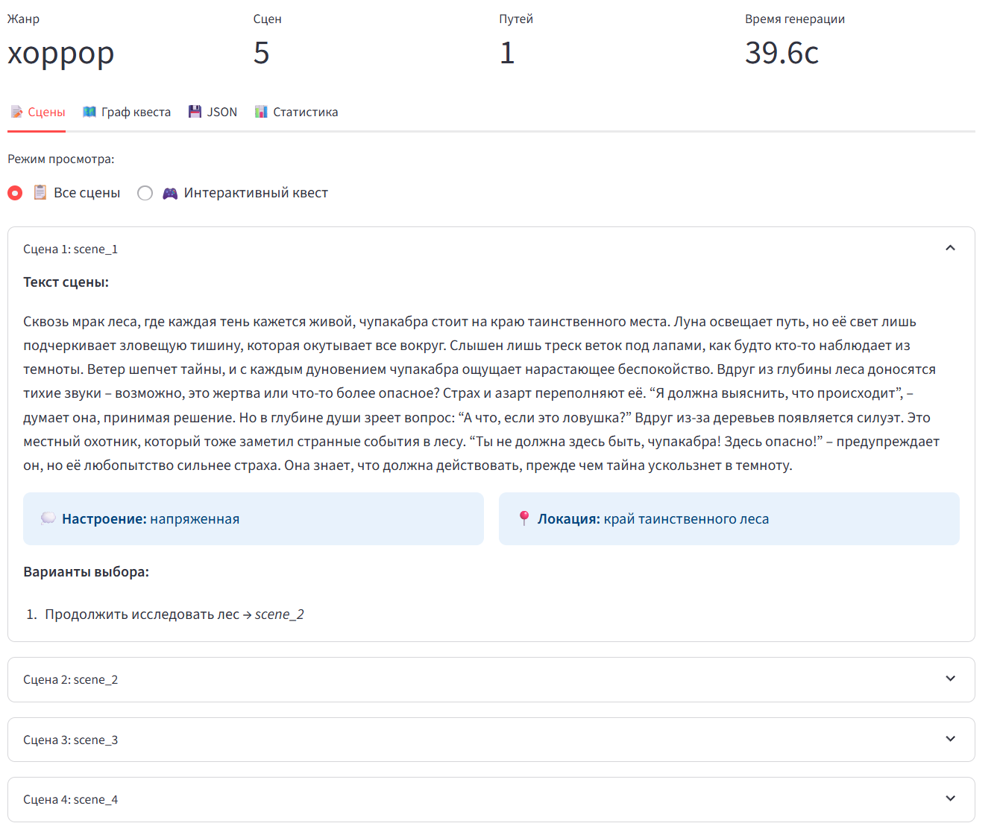
        <i>Final scene</i>
      </td>
    </tr>
  </table>
  
  </details>
  
  <details open>
  <summary><b>🎮 Interactive Elements</b></summary>
  
  <br>
  
  <table>
    <tr>
      <td width="33%" align="center">
        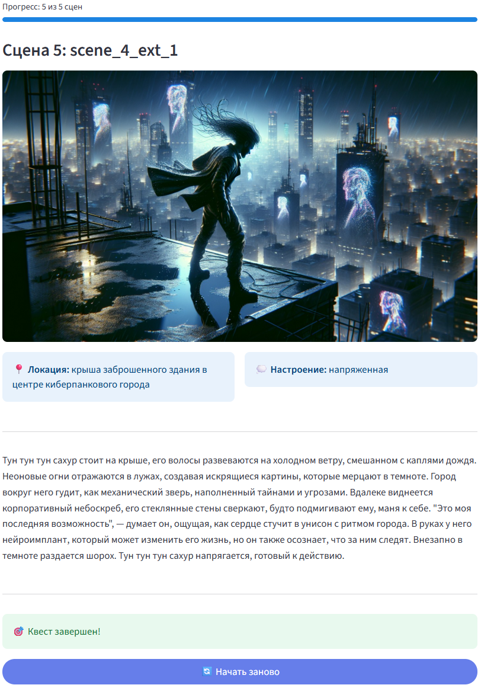
        <i>Action choices</i>
      </td>
      <td width="33%" align="center">
        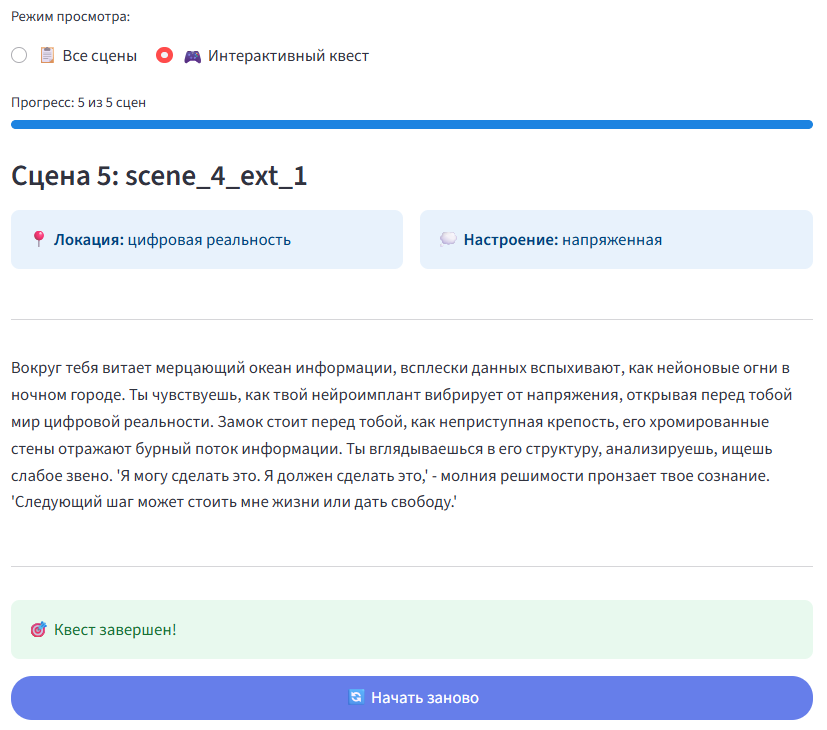
        <i>Dialog system</i>
      </td>
      <td width="33%" align="center">
        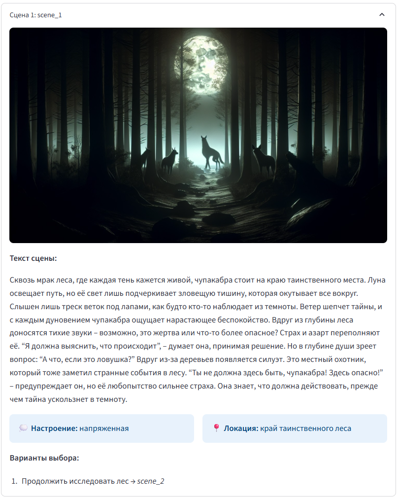
        <i>Inventory management</i>
      </td>
    </tr>
  </table>
  
  </details>
  
  <details>
  <summary><b>🎯 Key UI Features</b></summary>
  
  <br>
  
  - ✨ **Modern Design** - Clean and intuitive Streamlit-based interface
  - 🚀 **Quick Navigation** - Easy switching between sections
  - 📈 **Progress Visualization** - Track every generation stage
  - 💾 **Quest Management** - Save and load generated stories
  - 🌍 **Multi-language** - Support for Russian and English languages
  - 🎨 **Rich Visualization** - Detailed scenes with multiple display options
  - 🔀 **Interactivity** - Full-featured choice and consequence system
  
  </details>
</div>

---

## 🌟 Features

- **🎨 Interactive Web UI** - Full-featured Streamlit interface for easy quest creation
- **🤖 AI-Powered Story Generation** - Creates dynamic quests from simple text descriptions
- **🔀 Branching Narratives** - Multiple paths and choices for player agency
- **⚡ Story2Game Integration** - Structured logic with preconditions and effects
- **🎭 SceneCraft Visualization** - 3D scene layouts and visual generation
- **🧠 RAG-Enhanced Content** - Genre-specific knowledge retrieval for richer narratives
- **📊 Multiple Output Formats** - JSON, Python code, Unity/Unreal formats
- **🌍 Multi-language Support** - English and Russian language models
- **🚀 REST API** - FastAPI backend for programmatic access
- **🏗️ Level Generation** - WFC, diffusion models, and ML-based level design
- **📈 Analytics & Metrics** - Quality assessment and generation insights

## 🎮 How it Works?

<div align="center">
  <table>
    <tr>
      <td align="center" width="25%">
        <h4>1️⃣ Describe Scenario</h4>
        <p>Enter a text description of your story</p>
      </td>
      <td align="center" width="25%">
        <h4>2️⃣ Configure Settings</h4>
        <p>Choose AI model and generation parameters</p>
      </td>
      <td align="center" width="25%">
        <h4>3️⃣ Generation</h4>
        <p>AI creates an interactive quest</p>
      </td>
      <td align="center" width="25%">
        <h4>4️⃣ Result</h4>
        <p>Get ready quest with visualization</p>
      </td>
    </tr>
  </table>
</div>

## 🚀 Quick Start

### Prerequisites

- Python 3.8+
- OpenAI API key (required)
- Anthropic API key (optional, for Claude models)

### Installation

1. **Clone the repository**
```bash
git clone https://github.com/Sergey-1221/game-story-ai.git
cd game-story-ai
```

2. **Create virtual environment**
```bash
# Windows
python -m venv venv
venv\Scripts\activate

# Linux/macOS
python -m venv venv
source venv/bin/activate
```

3. **Install dependencies**
```bash
pip install -r requirements.txt

# Download language models
python -m spacy download ru_core_news_sm
python -m spacy download en_core_web_sm
```

4. **Configure environment**
```bash
# Windows
copy .env.example .env

# Linux/macOS
cp .env.example .env
```

Edit `.env` and add your API keys:
```env
OPENAI_API_KEY=your-openai-api-key
ANTHROPIC_API_KEY=your-anthropic-api-key  # Optional
```

### Running the Application

**🎨 Web Interface (Recommended)**
```bash
# Windows
run_ui.bat
# or
venv\Scripts\streamlit.exe run streamlit_app.py

# Linux/macOS
./run_ui.sh
# or
streamlit run streamlit_app.py
```

Open http://localhost:8501 in your browser for the full-featured UI.

**🔌 API Server**
```bash
# Windows
start_api.bat
# or
venv\Scripts\python.exe -m uvicorn src.api.main:app --reload

# Linux/macOS
uvicorn src.api.main:app --reload
```

## 📖 Usage Examples

### Basic Quest Generation

```python
from src.quest_generator import QuestGenerator
from src.core.models import GenerationConfig

# Initialize generator
generator = QuestGenerator()

# Configure generation
config = GenerationConfig(
    model="gpt-4o-mini",
    temperature=0.7,
    use_rag=True,
    branching_depth=2
)

# Generate quest
scenario = "A brave knight must rescue a princess from a dragon"
quest = await generator.generate(scenario, config)

# Save result
generator.save_quest(quest, "quest.json")
```

### Advanced Integration with Story2Game and SceneCraft

```python
from src.modules.integrated_quest_generator import IntegratedQuestGenerator

# Initialize integrated generator
generator = IntegratedQuestGenerator()

# Generate with full pipeline
result = await generator.generate(
    scenario="Cyberpunk hacker infiltrates megacorp",
    config=config
)

# Access different outputs
quest_structure = result["quest"]
logic_system = result["logic"]
visualizations = result["visualization"]
```

### CLI Usage

```bash
# Generate quest from file
python main.py --input scenario.txt --output quest.json

# Quick generation
python main.py --text "Space explorer discovers alien artifact" --format json
```

### API Usage

```bash
# Generate quest via API
curl -X POST http://localhost:8000/generate \
  -H "Content-Type: application/json" \
  -d '{
    "scenario": "Knight rescues princess from dragon",
    "config": {
      "model": "gpt-4o-mini",
      "temperature": 0.7
    }
  }'
```

## 🏗️ Architecture

### Generation Pipeline

```
Input Text → Parser → Knowledge Retrieval → Story Planning → Scene Generation
                                                                     ↓
Output ← Formatting ← Validation ← Logic Enhancement ← Visualization
```

### Key Components

- **InputParser**: Extracts scenario parameters (genre, hero, goal)
- **KnowledgeBase**: RAG system for genre-specific content
- **StoryPlanner**: Creates quest structure with branching paths
- **SceneGenerator**: Generates detailed scene descriptions
- **Story2GameEngine**: Adds game logic (preconditions, effects)
- **SceneCraftVisualizer**: Creates 3D layouts and visuals
- **BranchManager**: Ensures quest integrity and coherence
- **OutputFormatter**: Produces various output formats

## 📁 Project Structure

```
game-story-ai/
├── src/
│   ├── core/
│   │   └── models.py               # Data models and structures
│   ├── modules/
│   │   ├── input_parser.py         # Input processing
│   │   ├── knowledge_base.py       # RAG implementation
│   │   ├── scene_generator.py      # Scene generation
│   │   ├── story2game_engine.py    # Logic system
│   │   ├── scenecraft_visualizer.py # 3D visualization
│   │   └── integrated_quest_generator.py # Full pipeline
│   ├── api/
│   │   └── main.py                # FastAPI server
│   └── quest_generator.py         # Main generator class
├── data/
│   ├── knowledge_base/            # Genre templates and content
│   └── chroma/                    # Vector database storage
├── examples/                      # Demo scripts
├── tests/                         # Test suite
├── streamlit_app.py              # Web UI
└── requirements.txt              # Dependencies
```

## 🛠️ Configuration

### Environment Variables

Create a `.env` file with:

```env
# Required
OPENAI_API_KEY=your-api-key

# Optional
ANTHROPIC_API_KEY=your-claude-key
DEFAULT_MODEL=gpt-4o-mini
LOG_LEVEL=INFO
CHROMA_PERSIST_DIRECTORY=./data/chroma
```

### Generation Config Options

```python
config = GenerationConfig(
    model="gpt-4o-mini",          # LLM model
    temperature=0.7,              # Creativity (0-1)
    max_tokens=2000,              # Response length
    use_rag=True,                 # Enable knowledge retrieval
    branching_depth=2,            # Quest complexity
    enable_visualization=True,     # Generate visuals
    output_format="json"          # Output format
)
```

## 📊 Output Examples

### Quest JSON Structure

```json
{
  "title": "The Dragon's Keep",
  "genre": "fantasy",
  "hero": {
    "name": "Sir Galahad",
    "class": "Knight"
  },
  "scenes": [
    {
      "id": "scene_1",
      "description": "You stand before the dragon's lair...",
      "choices": [
        {
          "text": "Enter stealthily",
          "next_scene": "scene_2a"
        },
        {
          "text": "Challenge the dragon",
          "next_scene": "scene_2b"
        }
      ]
    }
  ]
}
```

### Enhanced Output with Logic

```json
{
  "quest": { /* Basic quest structure */ },
  "logic": {
    "world_state": {
      "objects": ["sword", "shield", "key"],
      "locations": ["castle", "forest", "cave"]
    },
    "actions": {
      "take_sword": {
        "preconditions": ["at(castle)", "not has(sword)"],
        "effects": ["has(sword)", "armed(true)"]
      }
    }
  },
  "visualization": {
    "scenes": {
      "scene_1": {
        "layout": "3d_layout.json",
        "image": "scene_1.png"
      }
    }
  }
}
```

## 🔌 API Reference

### REST Endpoints

- `POST /generate` - Generate quest from JSON
- `POST /generate/file` - Generate from uploaded file
- `POST /generate/quick` - Quick generation with parameters
- `GET /quest/{quest_id}` - Retrieve generated quest
- `GET /examples` - Get example scenarios

### WebSocket Support

```javascript
const ws = new WebSocket('ws://localhost:8000/ws');
ws.send(JSON.stringify({
  action: 'generate',
  scenario: 'Fantasy adventure'
}));
```

## 🧪 Testing

```bash
# Run all tests
pytest

# Run with coverage
pytest --cov=src

# Run specific tests
pytest tests/unit/
pytest tests/integration/

# Run test scripts
python test_generation.py
python test_quest_generation.py
```

## 🎮 Game Engine Integration

### Unity Export

```csharp
// Generated Unity-compatible code
public class QuestManager : MonoBehaviour {
    private QuestData questData;
    
    void Start() {
        LoadQuest("quest.json");
    }
}
```

### Unreal Engine Export

```cpp
// Generated Unreal-compatible code
UCLASS()
class AQuestManager : public AActor {
    GENERATED_BODY()
    
public:
    void LoadQuest(const FString& QuestPath);
};
```

## 🤝 Contributing

Contributions are welcome! Please feel free to submit a Pull Request.

1. Fork the repository
2. Create your feature branch (`git checkout -b feature/AmazingFeature`)
3. Commit your changes (`git commit -m 'Add some AmazingFeature'`)
4. Push to the branch (`git push origin feature/AmazingFeature`)
5. Open a Pull Request

## 📝 License

This project is licensed under the MIT License - see the [LICENSE](LICENSE) file for details.

## 🙏 Acknowledgments

- OpenAI for GPT models
- Anthropic for Claude models
- Story2Game framework for structured game logic
- SceneCraft for 3D visualization capabilities
- Spacy for NLP processing

## 📧 Contact

Sergey - [@Sergey-1221](https://github.com/Sergey-1221)

Project Link: [https://github.com/Sergey-1221/game-story-ai](https://github.com/Sergey-1221/game-story-ai)

---

<p align="center">
  Made with ❤️ by the Game Story AI team
</p>